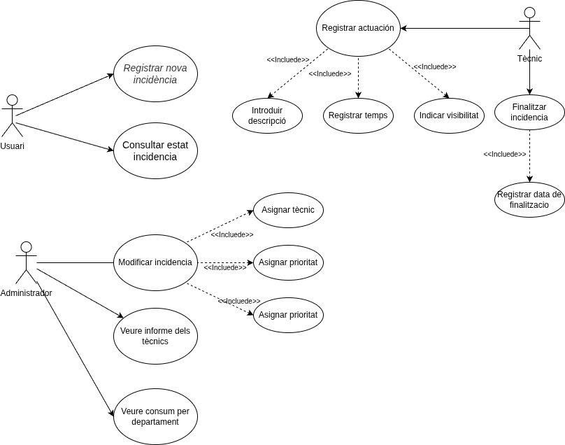
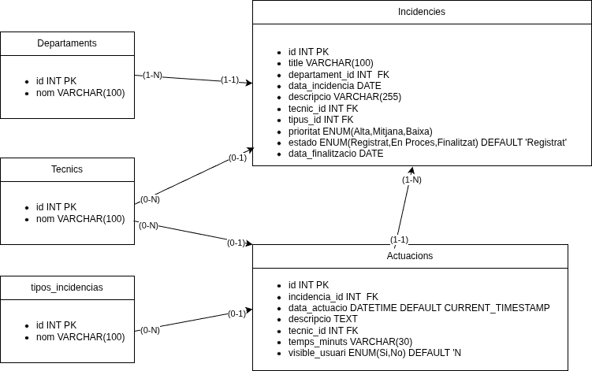

# Gestió d'Incidències - Institut Pedralbes

Aquest projecte és una aplicació web modular dissenyada per centralitzar i gestionar les peticions de suport tècnic de l'Institut Pedralbes. El sistema permet tot el flux de treball: des del report de l'usuari fins a la resolució final i l'anàlisi de dades.

---

## Funcionalitats Principals

### Per a Usuaris:

- **Registre de tiquets:** Formulari simplificat per enviar incidències indicant el títol, el departament, la data i la descripció del problema.
- **Comprovació de tiquets:** Pantalla de confirmació amb la generació d'un ID únic i resum de la petició.
- **Visualització de l'historial:** Possibilitat de veure les actuacions que els tècnics han marcat com a visibles.

### Per a Tècnics i Administradors:

- **Tauler de control (Dashboard):** Estadístiques d'accessos amb gràfic de tendències per dia, top pàgines visitades i log dels últims 10 accessos. Les dades provenen de MongoDB.
- **Gestió de tiquets:** Llistat interactiu per assignar prioritat, tipologia d'incidència i tècnic responsable mitjançant finestres modals. Ordenació per prioritat o data.
- **Detall d'incidència:** Vista completa on es poden editar el tècnic, la prioritat i el tipus d'incidència, i veure l'historial d'actuacions visibles.
- **Historial d'actuacions:** Registre detallat de cada intervenció, incloent el temps en minuts i la possibilitat de fer visible el comentari.
- **Actualització automàtica d'estat:** El sistema canvia l'estat del tiquet automàticament a "En Procés" quan es registra la primera actuació, i a "Finalitzat" en tancar-lo.
- **Seguiment per tècnic:** Panell amb el temps mitjà d'actuació, incidències assignades i tancades per cada tècnic, amb accés al seu llistat d'incidències.
- **Seguiment per departament:** Informe amb les incidències assignades, tancades i el temps total utilitzat per departament.
- **Notificació per correu:** En crear una nova incidència s'envia un correu de notificació via SMTP amb PHPMailer.
- **Cerca per ID:** Barra de cerca a la navegador per accedir directament a qualsevol incidència per ID.

---

## Tecnologies Utilitzades

- **Backend:** PHP 8.x amb l'extensió MySQLi.
- **Base de Dades Principal:** MySQL 8.0 (via Docker).
- **Base de Dades de Logs:** MongoDB (mongodb-atlas-local via Docker).
- **Frontend:** HTML5, CSS3 i JavaScript.
- **Estils:** Bootstrap 5.3 amb el tema Slate de Bootswatch + Bootstrap Icons.
- **Llibreries PHP:** PHPMailer (correu SMTP), MongoDB PHP Library.
- **Gestió de dependències:** Composer.
- **Seguretat:** Consultes preparades (prepared statements) per evitar injeccions SQL. Credencials protegides via fitxer .env

---

## Serveis Docker

| Servei        | Imatge                        | Port local | Descripció                        |
|---------------|-------------------------------|------------|-----------------------------------|
| app           | Build local (Dockerfile)      | 8080       | Aplicació PHP                     |
| db            | mysql:8.0                     | 3306       | Base de dades MySQL               |
| phpmyadmin    | phpmyadmin:latest             | 8081       | Gestió visual de MySQL            |
| mongodb       | mongodb/mongodb-atlas-local   | 27019      | Base de dades de logs MongoDB     |
| mongo-express | mongo-express                 | 8082       | Gestió visual de MongoDB          |

---

## Instal·lació i Configuració

**1. Clonar el repositori:**

git clone https://github.com/inspedralbes/projecte-1daw-25-26-g1_pau_ilia.git

cd projecte-1daw-25-26-g1_pau_ilia

**2. Configurar l'entorn:**

Crear un fitxer .env dins de la carpeta src/ amb les següents variables:

DB_HOST=db
DB_NAME=gi3p_db
DB_USER=dev_user
DB_PASS=dev_password
MONGODB_INITDB_ROOT_USERNAME=user
MONGODB_INITDB_ROOT_PASSWORD=pass

**3. Instal·lar dependències PHP:**

cd src
composer install

**4. Aixecar els contenidors:**

docker-compose up -d

L'aplicació estarà disponible a http://localhost:8080

---

## Pàgina Final

http://g1.daw.inspedralbes.cat

---

## Diagramas i Wireframe

**Diagrama de casos d'us:**

**Diagrama del model E-R:**

**Wireframe:**

https://www.figma.com/proto/HWrIN28FzKiSmQZHQrCmG1/Untitled?node-id=1-1021&p=f&t=D2YmmamacXPsax3N-0&scaling=scale-down&content-scaling=fixed&page-id=0%3A1&starting-point-node-id=1%3A1021

---

## Pàgines amb validació WCAG AA

- formulari_incidencia.php
- todas_incidencias.php
